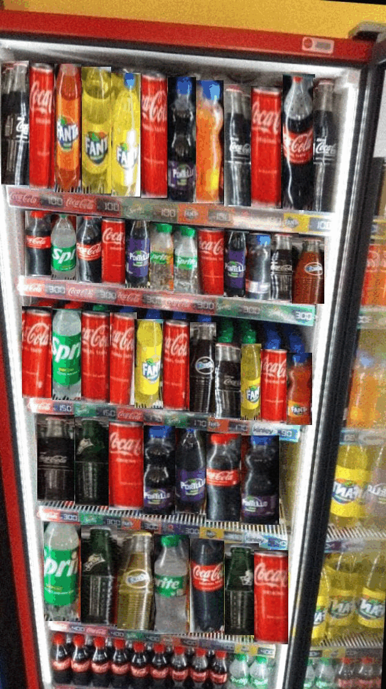

# 🥤 Soft Drinks Fridge - YOLOv11 Object Detection

A complete machine learning pipeline for detecting and classifying soft drink bottles in a refrigerator using YOLOv11, with synthetic data augmentation via crop swapping.

<p align="center">
  
</p>

## 🎯 Overview

This project implements:
- **YOLOv11 Detection**: State-of-the-art object detection model
- **Synthetic Data Generation**: Augments training data by intelligently swapping crops between images
- **COCO Format Support**: Works with COCO-annotated datasets
- **Complete Training Pipeline**: End-to-end training, validation, and visualization
- **10 Soft Drink Classes**: CocaCola, Creamsoda, Fanta, Gingerbeer, Portello, Soda, Sprite, Water, Retail, and more

## 📋 Dataset Structure

```
data/
├── original/                 # Original COCO-annotated dataset
│   ├── train/
│   │   ├── *.jpg
│   │   └── _annotations.coco.json
│   ├── valid/
│   │   ├── *.jpg
│   │   └── _annotations.coco.json
│   └── test/
│       ├── *.jpg
│       └── _annotations.coco.json
└── synthetic/               # Generated synthetic augmented data
    ├── train/
    │   ├── images/
    │   │   ├── *.jpg        # Original + synthetic images
    │   │   └── *_swap*.jpg
    │   ├── labels/          # YOLO format labels
    │   │   └── *.txt
    │   └── _annotations.coco.json
    ├── valid/
    └── test/
```

## 🚀 Quick Start

### 1. Installation

```bash
# Clone or download the repository
cd soft-drink-fridge

# Install dependencies
pip install -r requirements.txt
```

### 2. Prepare Your Data

Place your COCO-annotated dataset in `data/original/`:
```
data/original/train/_annotations.coco.json
data/original/valid/_annotations.coco.json
data/original/test/_annotations.coco.json
```

### 3. Generate Synthetic Data (Optional)

```bash
python train.py --generate-synthetic --input-data-root data/original --data-root data/synthetic
```

This creates 20 augmented variations of each image by swapping object crops

### 4. Train Model

```bash
python train.py \
    --data-root data/synthetic \
    --model yolov11n \
    --epochs 100 \
    --batch-size 16 \
    --img-size 640
```

**Model Variants:**
- `yolov11n` - Nano (fastest, smallest)
- `yolov11s` - Small
- `yolov11m` - Medium
- `yolov11l` - Large
- `yolov11x` - Extra Large (most accurate)

### 5. Visualize Results

```bash
# View dataset statistics
python visualize.py --task stats \
    --coco-json data/synthetic/train/_annotations.coco.json

# View annotations with bounding boxes
python visualize.py --task annotations \
    --coco-json data/synthetic/train/_annotations.coco.json \
    --images-dir data/synthetic/train/images \
    --num-samples 5

# View model predictions
python visualize.py --task predictions \
    --model runs/train/yolov11_YYYYMMDD_HHMMSS/weights/best.pt \
    --images-dir data/synthetic/test/images \
    --num-samples 5 \
    --conf 0.5

# Plot training curves
python visualize.py --task training \
    --results-dir runs/train/yolov11_YYYYMMDD_HHMMSS
```

## 📦 Core Components

### `synthetic_data.py`
Handles synthetic data generation through crop swapping:
- **`swap_coco_crops()`**: Intelligently swaps object crops between images
- **`generate_synthetic_dataset()`**: Batch generates augmented dataset
- Supports two resize modes: "stretch" and "fit" (aspect ratio preserved)
- Optional Gaussian blur feathering for seamless seams

**Key Features:**
```python
from synthetic_data import generate_synthetic_dataset

generate_synthetic_dataset(
    input_root="data/original",
    output_root="data/synthetic",
    num_aug_per_image=20,      # Create 20 variations per original
    resize_mode="stretch",      # or "fit"
    feather=1                   # Blur radius for edge blending
)
```

### `train.py`
Complete training pipeline:
- **`convert_coco_to_yolo()`**: Converts COCO format to YOLO format
- **`prepare_data_for_yolo()`**: Organizes data structure (images/ + labels/)
- **`train_yolov11()`**: Trains the model with optimized hyperparameters
- **`setup_dataset_yaml()`**: Creates YAML config for YOLOv11

**Usage:**
```bash
# Full pipeline with synthetic data
python train.py \
    --generate-synthetic \
    --input-data-root data/original \
    --data-root data/synthetic \
    --model yolov11m \
    --epochs 100 \
    --batch-size 16 \
    --img-size 640 \
    --device 0 \
    --patience 20

# Training only (if data already prepared)
python train.py --no-prepare --data-root data/synthetic
```

### `visualize.py`
Comprehensive visualization utilities:
- **Annotations**: View COCO bounding boxes on images
- **Predictions**: Visualize model predictions with confidence scores
- **Statistics**: Class distribution, instance counts, bbox size analysis
- **Training Curves**: Plot loss, mAP, precision, recall

**Usage:**
```bash
# All visualization tasks
python visualize.py --task [annotations|predictions|stats|training] [options]
```

## 🔧 Advanced Usage

### Custom Synthetic Data Generation

```python
from synthetic_data import swap_coco_crops
from PIL import Image

# Load image and annotations
img = Image.open("image.jpg").convert("RGB")
annotations = [...]  # COCO format

# Generate augmented version
aug_img, aug_anns = swap_coco_crops(
    img,
    annotations,
    seed=42,                # Reproducible
    resize_mode="fit",      # Keep aspect ratio
    feather=3,              # Stronger edge blending
    swap_labels=True        # Swap class labels with crops
)
```

### Model Inference

```python
from ultralytics import YOLO

# Load trained model
model = YOLO("runs/train/yolov11_YYYYMMDD_HHMMSS/weights/best.pt")

# Run inference
results = model("image.jpg", conf=0.5)

# Access detections
for result in results:
    for box in result.boxes:
        x1, y1, x2, y2 = box.xyxy[0]
        conf = box.conf[0]
        class_id = box.cls[0]
        print(f"Class: {class_id}, Confidence: {conf:.2f}")
```

### Batch Inference

```python
from ultralytics import YOLO
from pathlib import Path

model = YOLO("best.pt")

# Process entire directory
image_dir = "data/synthetic/test/images"
results = model(image_dir, conf=0.5, device=0)

# Optionally save results
for result in results:
    result.save(filename=f"predictions/{result.save_dir.name}.jpg")
```

## 📊 Dataset Statistics

The project handles:
- **10 Drink Classes**: Including brand-specific variants (CocaCola 250ml, generic sodas, etc.)
- **Multi-Scale Objects**: Bottles appear at various sizes in fridge images
- **Complex Backgrounds**: Real refrigerator backgrounds with multiple bottles
- **COCO Format**: Industry-standard annotation format with polygon segmentation support


## 🎓 Understanding the Pipeline

### 1. Data Preparation
```
Original COCO → Convert to YOLO format → Create images/labels structure
```

### 2. Synthetic Augmentation
```
Original Images + Annotations → Swap Crops (20x per image) → 
Augmented Images + Updated Labels → Merged COCO JSON
```

### 3. Training
```
Prepared Data → YOLOv11 Model → Training Loop → Validation → Best Weights
```

### 4. Evaluation
```
Best Model → Test Set → mAP/Precision/Recall → Visualization
```

## 🖼️ Visualization Examples

### Dataset Statistics
- Class distribution histograms
- Images per class breakdown
- Bounding box size distribution
- Dataset summary statistics

### Training Curves
- Training loss convergence
- Validation mAP50 improvements
- Precision/Recall curves
- Early stopping patterns

### Predictions
- Detected bounding boxes
- Confidence scores
- Class labels with colors
- Side-by-side comparisons

## 🔍 Troubleshooting

### GPU Memory Issues
```bash
# Use smaller model or reduce batch size
python train.py --model yolov11n --batch-size 8
```

### CUDA Not Available
```bash
# Install PyTorch with CPU support
pip install torch torchvision torchaudio --index-url https://download.pytorch.org/whl/cpu
```

### Missing Annotations
```bash
# Verify COCO JSON structure
import json
with open("_annotations.coco.json") as f:
    data = json.load(f)
    print(f"Images: {len(data['images'])}")
    print(f"Annotations: {len(data['annotations'])}")
    print(f"Categories: {len(data['categories'])}")
```

### Poor Detection Performance
1. Check if synthetic data is helping (compare with/without)
2. Increase training epochs
3. Adjust learning rate
4. Verify class balance
5. Try larger model (yolov11m or yolov11l)

## 📈 Performance Optimization

### Training Speed
- Use GPU acceleration (CUDA)
- Reduce image size (default 640)
- Increase batch size (if GPU memory allows)
- Use mixed precision (automatic)

### Model Size
- Start with `yolov11n` (nano, 2.6M params)
- Scale to `yolov11m` (medium, 20.1M params) for better accuracy
- Use `yolov11x` (extra large, 68.2M params) for maximum accuracy

### Data Strategy
- Use synthetic augmentation to reduce overfitting
- Balance class distribution if needed
- Remove degenerate samples (too small/occluded objects)
- Consider mosaic augmentation (enabled by default)

## 📝 Output Structure

```
runs/train/
└── yolov11_YYYYMMDD_HHMMSS/
    ├── weights/
    │   ├── best.pt          # Best model (for inference)
    │   ├── last.pt          # Last checkpoint
    │   └── ...
    ├── plots/
    │   ├── confusion_matrix.png
    │   ├── results.png
    │   └── ...
    ├── results.csv          # Training metrics per epoch
    └── events.out.tfevents  # Tensorboard logs
```

## 🤝 Contributing

To extend this project:

1. **New Synthetic Augmentations**: Modify `synthetic_data.py`
2. **Custom Training Configs**: Adjust hyperparameters in `train.py`
3. **New Visualizations**: Add functions to `visualize.py`
4. **Data Format Support**: Extend format converters

## 📚 References

- [Ultralytics YOLOv11 Docs](https://docs.ultralytics.com/)
- [COCO Dataset Format](https://cocodataset.org/)
- [YOLO Format Specification](https://docs.ultralytics.com/datasets/detect/)

## 📄 License

This project is provided as-is for research and educational purposes.

## 🙏 Acknowledgments

- Built with [Ultralytics YOLOv11](https://github.com/ultralytics/ultralytics)
- Synthetic data augmentation via crop swapping
- COCO format support for standardized annotations

---
